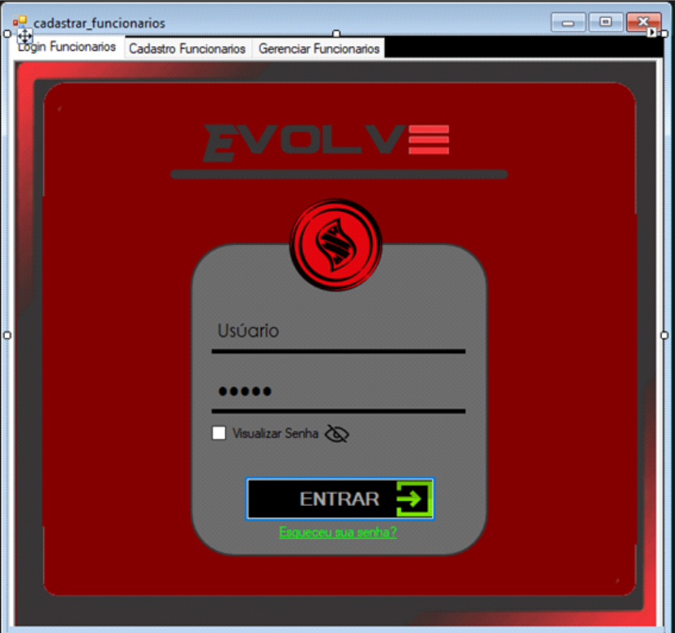
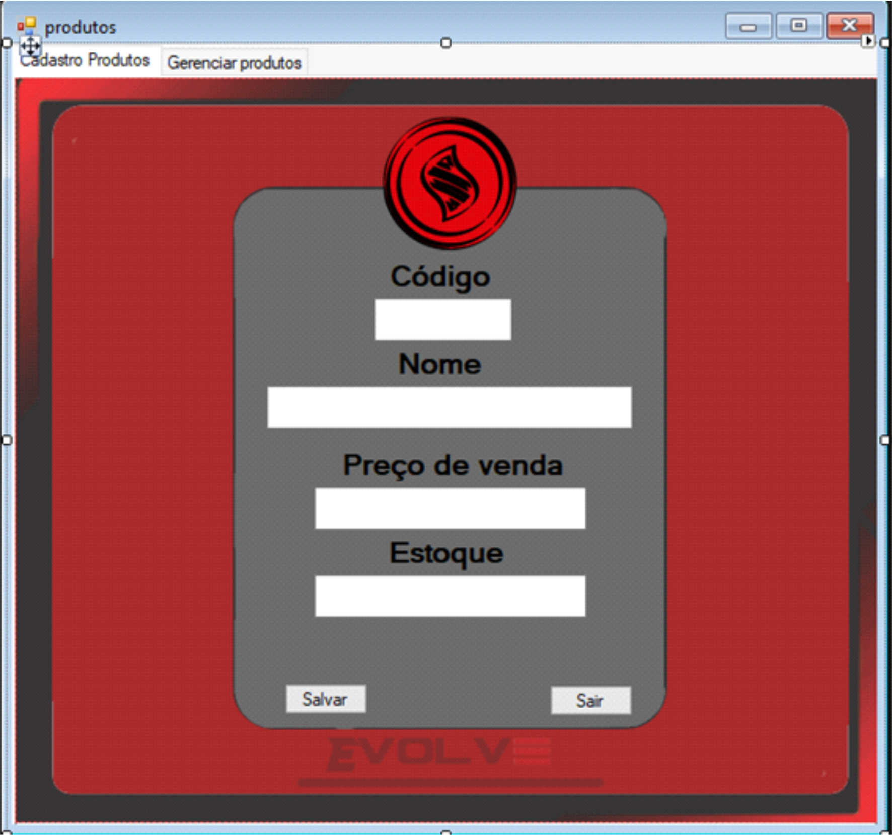

# Sistema de Gerenciamento de Academias

Este projeto é um sistema desktop completo desenvolvido para gerenciamento de academias, permitindo o controle de usuários, treinos personalizados e venda de produtos. Desenvolvido em Visual Basic .NET com interface gráfica, ele oferece diferentes níveis de acesso para otimizar as operações diárias de uma academia.

## Funcionalidades Principais

O sistema conta com um robusto módulo de login que diferencia o acesso baseado no perfil do usuário, garantindo que cada tipo de acesso tenha funcionalidades específicas:

### Login Multiusuário
Acesso seguro com autenticação para diferentes perfis:
* **Administrador:** Controle total do sistema.
* **Aluno:** Acesso a informações pessoais e treinos.
* **Personal Trainer:** Criação e gerenciamento de treinos.
* **Atendente:** Realização de vendas e operações de balcão.

### Funções do Administrador
O administrador possui controle total sobre o sistema, incluindo:
* **Gerenciamento de Contas:** Capacidade de adicionar e excluir contas de usuários (alunos, pessoais, atendentes, outros administradores).
* **Cadastro de Produtos:** Registro de produtos que podem ser vendidos no balcão da academia (ex: suplementos, camisetas, etc.).

### Funções do Personal Trainer
O Personal Trainer pode otimizar a experiência do aluno com treinos adaptados:
* **Criação de Treinos Personalizados:** Desenvolve planos de treino específicos para cada aluno, com base nos objetivos informados no cadastro do aluno.
* **Atribuição de Treinos:** Associa os treinos criados aos respectivos alunos.

### Funções do Aluno
O aluno tem acesso direto às suas informações e treinos:
* **Visualização de Treinos:** Acesso ao treino personalizado criado pelo Personal Trainer.

### Funções do Atendente
O atendente gerencia as operações de balcão e vendas:
* **Venda de Produtos:** Realiza a venda dos produtos cadastrados pelo administrador.

## Tecnologias Utilizadas

* **Linguagem de Programação:** Visual Basic .NET
* **Framework:** .NET Framework
* **Interface Gráfica (GUI):** Windows Forms
* **Banco de Dados:** Microsoft Access

## Como Rodar o Projeto

Para configurar e executar este projeto localmente, siga os passos abaixo:

1.  **Pré-requisitos:**
    * Certifique-se de ter o **Visual Studio** (preferencialmente 2019 ou mais recente) instalado com os componentes para desenvolvimento de desktop com .NET.
    * Para o banco de dados, é necessário ter o **Microsoft Access** instalado ou os drivers de conectividade do Access (Microsoft Access Database Engine Redistributable) para que a aplicação possa se conectar ao arquivo `.accdb` (ou `.mdb`).

2.  **Clonar o Repositório:**
    ```bash
    git clone [https://github.com/gustavovolpi/academia-integrado.git](https://github.com/gustavovolpi/academia-integrado.git) # Substitua pelo link do seu repositório
    ```

3.  **Abrir no Visual Studio:**
    * Navegue até a pasta `academia_integrado 2605`.
    * Abra o arquivo de solução (`academia_integrado.sln`) no Visual Studio.

4.  **Configurar o Banco de Dados:**
    * O banco de dados é um arquivo do Microsoft Access (provavelmente `.accdb` ou `.mdb`) localizado dentro da pasta do projeto.
    * Verifique a string de conexão no arquivo `App.config` (localizado na pasta raiz do projeto) para garantir que ela aponte corretamente para o arquivo do banco de dados.
    * Certifique-se de que o arquivo do banco de dados (`.accdb` ou `.mdb`) está presente na pasta esperada pelo projeto.

5.  **Compilar e Executar:**
    * No Visual Studio, compile a solução (`Ctrl+Shift+B` ou `Build > Build Solution`).
    * Execute o projeto (`F5` ou `Debug > Start Debugging`).

## Screenshots

Para uma visão rápida da interface e das funcionalidades do sistema:


_Tela de Login_


_Tela de Cadastro Geral_


_Tela de Cadastro de Aulas_


_Tela de Cadastro de Funcionários_


_Tela de Gerenciamento de Funcionários_


_Tela de Cadastro de Produtos_


_Tela de Gerenciamento de Produtos_


_Tela de Cadastro de Treino_


_Menu Principal do Administrador_

## Contribuição

Contribuições são bem-vindas! Sinta-se à vontade para abrir issues ou pull requests.

## Licença

Este projeto está sob a [MIT License](LICENSE).

---

### Feito por:

Gustavo Volpi
[Seu perfil do GitHub](https://github.com/gustavovolpi)
[Seu perfil do LinkedIn](https://www.linkedin.com/in/gustavo-volpi/)